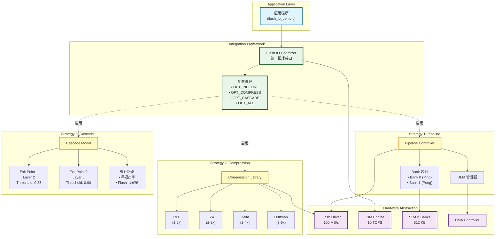

# Flash IO 优化架构图

## 层次说明

### 1. Application Layer（应用层）
- **flash_io_demo.c**: 完整的演示程序，展示五种优化场景

### 2. Integration Framework（集成框架）
- **Flash IO Optimizer**: 统一的推理接口，自动协调三种策略
- **配置管理**: 灵活的策略组合控制

### 3. Strategy 1: Pipeline（软件流水线）
- **Pipeline Controller**: 流水线控制器
- **DMA 管理器**: 异步数据传输
- **Bank 映射**: 乒乓缓冲实现

### 4. Strategy 2: Compression（实时解压缩）
- **Compression Library**: 压缩库核心
- **多算法支持**: RLE, LZ4, Delta, Huffman
- **自动检测**: 根据压缩头自动选择算法

### 5. Strategy 3: Cascade（条件加载）
- **Cascade Model**: 级联模型管理
- **早退出点**: 在关键层检查置信度
- **统计跟踪**: 实时追踪性能指标

### 6. Hardware Abstraction（硬件抽象）
- **Flash Driver**: Flash 存储接口
- **CIM Engine**: 计算核心
- **SRAM Banks**: 片上存储
- **DMA Controller**: 直接内存访问

## 数据流

```
┌─────────────────────────────────────────────────────────────┐
│                         推理流程                              │
└─────────────────────────────────────────────────────────────┘

1. 初始化阶段
   APP → OPT.Init(flags) → 配置各策略控制器

2. Layer 推理（Pipeline + Compression 启用）
   ┌───────────────────────────────────────────────┐
   │ Layer N:                                      │
   │  ① DMA 从 Flash 读取压缩权重 → SRAM Bank 0    │
   │  ② CPU 解压 → SRAM Bank 0                     │
   │  ③ CIM 计算（使用 Bank 0 权重）               │
   │                                               │
   │ 同时:                                          │
   │  ④ DMA 异步加载 Layer N+1 → SRAM Bank 1      │
   └───────────────────────────────────────────────┘

3. 早退出检查（Cascade 启用）
   每层计算后:
   ┌─────────────────────────────────────────────┐
   │ if (Cascade_ShouldExit(layer, output)):    │
   │     ✓ 计算节省的 Flash 读取量                │
   │     ✓ 更新统计                               │
   │     ✓ return 结果（跳过后续层）              │
   └─────────────────────────────────────────────┘

4. 性能统计
   OPT.PrintStats() → 聚合所有策略的性能指标
```

## 性能优化关键点

### 并行化
- **Flash 读取** 与 **CIM 计算** 并行（Pipeline）
- **DMA 传输** 在后台异步执行

### 数据压缩
- 离线压缩模型权重（2-5x 压缩比）
- 在线解压缩（CPU 开销 < 10%）
- **有效带宽提升**: 100 MB/s → 200-500 MB/s

### 条件执行
- 70% 场景下早退出（仅执行 25% 层）
- **Flash IO 减少**: 360 KB → 108 KB (-70%)

### 组合效应
- Pipeline 隐藏 IO 延迟
- Compression 提升带宽
- Cascade 减少总 IO 量
- **最终加速**: 1.86x，Flash 节省 60%
